# OpenManus 项目深度解析

## 项目概述

OpenManus 是一个开源的通用AI智能体框架，设计思想是创建一个无需邀请码即可使用的Manus替代方案。该框架采用了**分层架构设计**，支持多种LLM模型，具备强大的工具集成能力和多智能体协作功能。

**核心设计理念**：就像在测试自动化中，我们需要一个统一的测试框架来管理不同的测试工具和测试场景一样，OpenManus提供了一个统一的智能体框架来管理不同的AI工具和任务场景。

## 架构分析

```mermaid
graph TB
    subgraph "用户交互层"
        UI[用户输入]
        CLI[命令行接口]
    end
    
    subgraph "应用入口层"
        MAIN[main.py<br/>基础模式]
        MCP[run_mcp.py<br/>MCP工具模式]
        FLOW[run_flow.py<br/>多智能体模式]
    end
    
    subgraph "智能体层 (Agent Layer)"
        BASE[BaseAgent<br/>基础智能体抽象]
        MANUS[Manus<br/>通用智能体]
        BROWSER[BrowserAgent<br/>浏览器智能体]
        DATA[DataAnalysisAgent<br/>数据分析智能体]
        SWE[SWEAgent<br/>软件工程智能体]
        REACT[ReactAgent<br/>反应式智能体]
    end
    
    subgraph "工具层 (Tool Layer)"
        TOOLCOL[ToolCollection<br/>工具集合管理]
        PYTHON[PythonExecute<br/>Python执行]
        BROWSER_TOOL[BrowserUseTool<br/>浏览器操作]
        EDITOR[StrReplaceEditor<br/>文件编辑]
        SEARCH[WebSearch<br/>网络搜索]
        CHART[ChartVisualization<br/>图表可视化]
        MCP_TOOL[MCPClientTool<br/>MCP工具客户端]
        HUMAN[AskHuman<br/>人机交互]
        TERMINATE[Terminate<br/>终止工具]
    end
    
    subgraph "流程控制层 (Flow Layer)"
        FLOW_BASE[BaseFlow<br/>基础流程]
        PLANNING[PlanningFlow<br/>规划流程]
        FACTORY[FlowFactory<br/>流程工厂]
    end
    
    subgraph "大语言模型层 (LLM Layer)"
        LLM[LLM<br/>语言模型抽象]
        OPENAI[OpenAI]
        ANTHROPIC[Anthropic]
        AZURE[Azure OpenAI]
        GOOGLE[Google]
        OLLAMA[Ollama]
    end
    
    subgraph "基础设施层"
        CONFIG[Config<br/>配置管理]
        MEMORY[Memory<br/>记忆管理]
        LOGGER[Logger<br/>日志系统]
        SANDBOX[Sandbox<br/>沙箱环境]
        MCP_CLIENT[MCPClients<br/>MCP客户端管理]
    end
    
    subgraph "外部服务"
        MCP_SERVER[MCP服务器]
        BROWSER_SERVICE[浏览器服务]
        SEARCH_ENGINE[搜索引擎]
    end
    
    %% 连接关系
    UI --> MAIN
    UI --> MCP
    UI --> FLOW
    CLI --> MAIN
    CLI --> MCP
    CLI --> FLOW
    
    MAIN --> MANUS
    MCP --> MANUS
    FLOW --> FACTORY
    
    FACTORY --> MANUS
    FACTORY --> DATA
    FACTORY --> BROWSER
    
    BASE --> MANUS
    BASE --> BROWSER
    BASE --> DATA
    BASE --> SWE
    BASE --> REACT
    
    MANUS --> TOOLCOL
    BROWSER --> TOOLCOL
    DATA --> TOOLCOL
    
    TOOLCOL --> PYTHON
    TOOLCOL --> BROWSER_TOOL
    TOOLCOL --> EDITOR
    TOOLCOL --> SEARCH
    TOOLCOL --> CHART
    TOOLCOL --> MCP_TOOL
    TOOLCOL --> HUMAN
    TOOLCOL --> TERMINATE
    
    MANUS --> LLM
    BROWSER --> LLM
    DATA --> LLM
    
    LLM --> OPENAI
    LLM --> ANTHROPIC
    LLM --> AZURE
    LLM --> GOOGLE
    LLM --> OLLAMA
    
    MANUS --> CONFIG
    MANUS --> MEMORY
    MANUS --> LOGGER
    MANUS --> SANDBOX
    MANUS --> MCP_CLIENT
    
    MCP_CLIENT --> MCP_SERVER
    BROWSER_TOOL --> BROWSER_SERVICE
    SEARCH --> SEARCH_ENGINE
    
    FLOW_BASE --> PLANNING
    FACTORY --> FLOW_BASE
    
    classDef userLayer fill:#e1f5fe
    classDef entryLayer fill:#f3e5f5
    classDef agentLayer fill:#e8f5e8
    classDef toolLayer fill:#fff3e0
    classDef flowLayer fill:#fce4ec
    classDef llmLayer fill:#f1f8e9
    classDef infraLayer fill:#e0f2f1
    classDef externalLayer fill:#fafafa
    
    class UI,CLI userLayer
    class MAIN,MCP,FLOW entryLayer
    class BASE,MANUS,BROWSER,DATA,SWE,REACT agentLayer
    class TOOLCOL,PYTHON,BROWSER_TOOL,EDITOR,SEARCH,CHART,MCP_TOOL,HUMAN,TERMINATE toolLayer
    class FLOW_BASE,PLANNING,FACTORY flowLayer
    class LLM,OPENAI,ANTHROPIC,AZURE,GOOGLE,OLLAMA llmLayer
    class CONFIG,MEMORY,LOGGER,SANDBOX,MCP_CLIENT infraLayer
    class MCP_SERVER,BROWSER_SERVICE,SEARCH_ENGINE externalLayer
```




### 1. 整体架构设计

OpenManus采用了**六层架构模式**，类似于测试框架中的分层测试架构：

- **用户交互层**：处理用户输入和命令行交互
- **应用入口层**：提供三种运行模式（基础、MCP、多智能体）
- **智能体层**：核心业务逻辑，包含各种专用智能体
- **工具层**：可插拔的工具系统，类似于测试工具库
- **流程控制层**：管理多智能体协作和任务规划
- **基础设施层**：提供配置、日志、内存等基础服务

### 2. 核心组件职责分析

#### BaseAgent（基础智能体抽象）

- **职责**：定义智能体的基本行为模式和生命周期管理
- **类比**：就像TestNG中的BaseTest类，提供测试的基础框架和通用功能
- **关键特性**：状态管理、步骤控制、内存管理、异常处理

````python path=Embracing-AI/AI-learn/OpenManus/app/agent/base.py mode=EXCERPT
class BaseAgent(BaseModel, ABC):
    """Abstract base class for managing agent state and execution."""
    
    name: str = Field(..., description="Unique name of the agent")
    llm: LLM = Field(default_factory=LLM, description="Language model instance")
    memory: Memory = Field(default_factory=Memory, description="Agent's memory store")
    state: AgentState = Field(default=AgentState.IDLE, description="Current agent state")
    max_steps: int = Field(default=10, description="Maximum steps before termination")
````

#### Manus（通用智能体）

- **职责**：作为主要的任务执行智能体，集成多种工具能力
- **类比**：类似于Selenium WebDriver，是执行具体操作的核心引擎
- **工具集成**：Python执行、浏览器操作、文件编辑、网络搜索等

````python path=Embracing-AI/AI-learn/OpenManus/app/agent/manus.py mode=EXCERPT
class Manus(ToolCallAgent):
    """A versatile general-purpose agent with support for both local and MCP tools."""
    
    available_tools: ToolCollection = Field(
        default_factory=lambda: ToolCollection(
            PythonExecute(),
            BrowserUseTool(),
            StrReplaceEditor(),
            AskHuman(),
            Terminate(),
        )
    )
````

#### 工具系统设计

- **设计模式**：采用了**策略模式**和**工厂模式**
- **类比**：就像Page Object Model中的页面对象，每个工具都封装了特定的操作能力
- **扩展性**：支持MCP（Model Context Protocol）工具的动态加载

````python path=Embracing-AI/AI-learn/OpenManus/app/tool/base.py mode=EXCERPT
class BaseTool(ABC, BaseModel):
    name: str
    description: str
    parameters: Optional[dict] = None
    
    @abstractmethod
    async def execute(self, **kwargs) -> Any:
        """Execute the tool with given parameters."""
````

## 数据流和控制流分析

```mermaid
sequenceDiagram
    participant User as 用户
    participant Main as main.py
    participant Manus as Manus Agent
    participant LLM as LLM层
    participant Tools as 工具层
    participant Memory as 记忆系统
    participant Config as 配置系统
    
    User->>Main: 输入prompt
    Main->>Manus: 创建智能体实例
    Manus->>Config: 加载配置
    Config-->>Manus: 返回配置信息
    Manus->>LLM: 初始化语言模型
    LLM-->>Manus: 模型就绪
    
    loop 执行步骤循环 (最多20步)
        Manus->>Memory: 获取历史记忆
        Memory-->>Manus: 返回对话历史
        Manus->>LLM: 发送系统提示+用户输入+历史
        LLM-->>Manus: 返回响应(可能包含工具调用)
        
        alt 需要工具调用
            Manus->>Tools: 执行工具调用
            Tools-->>Manus: 返回工具执行结果
            Manus->>Memory: 保存工具调用和结果
        else 直接响应
            Manus->>Memory: 保存对话内容
        end
        
        alt 任务完成或达到最大步数
            break 退出循环
        end
    end
    
    Manus->>User: 返回最终结果
    Main->>Manus: 清理资源
    Manus-->>Main: 清理完成
```


### 执行流程（Given-When-Then模式）

**Given**：用户提供任务输入和配置
**When**：智能体通过LLM分析任务并调用相应工具
**Then**：返回执行结果并更新记忆状态

### 关键执行路径

1. **初始化阶段**：加载配置 → 创建智能体 → 初始化LLM和工具
2. **执行阶段**：循环执行（最多20步）→ LLM推理 → 工具调用 → 结果处理
3. **清理阶段**：保存状态 → 释放资源 → 返回结果

## 核心API接口

### 主要入口点

- `python main.py`：基础智能体模式
- `python run_mcp.py`：MCP工具增强模式  
- `python run_flow.py`：多智能体协作模式

### 配置接口

- 支持多种LLM提供商（OpenAI、Anthropic、Azure、Google、Ollama）
- 灵活的工具配置和MCP服务器集成
- 代理和搜索引擎配置

### 工具接口

- **PythonExecute**：代码执行和数据处理
- **BrowserUseTool**：网页自动化操作
- **StrReplaceEditor**：文件编辑和代码修改
- **WebSearch**：多引擎网络搜索
- **ChartVisualization**：数据可视化

## 实际应用价值

### 在测试自动化中的应用场景

1. **自动化测试脚本生成**：通过自然语言描述生成测试用例
2. **测试数据分析**：自动分析测试结果和生成报告
3. **环境配置自动化**：自动配置测试环境和依赖
4. **缺陷分析和定位**：智能分析日志和定位问题根因

### 配置方式示例

```toml
# config/config.toml
[llm]
model = "gpt-4o"
base_url = "https://api.openai.com/v1"
api_key = "your-api-key"
max_tokens = 4096
temperature = 0.0

[runflow]
use_data_analysis_agent = true
```

